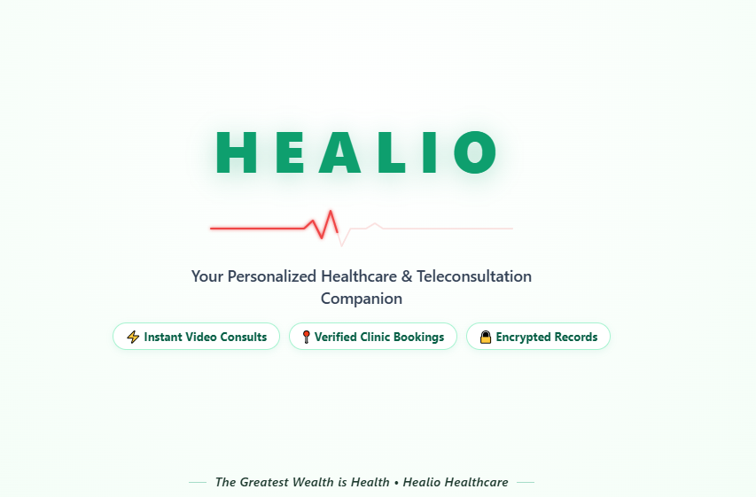
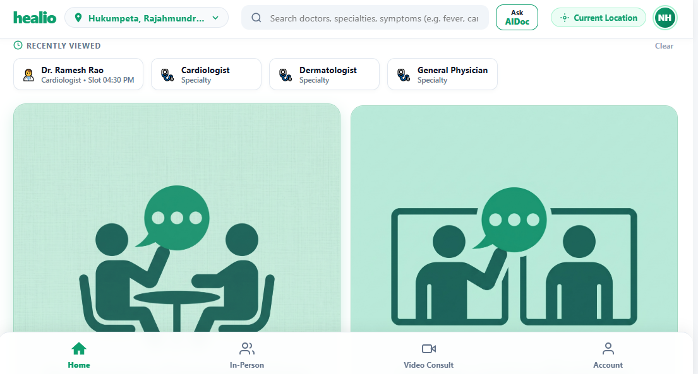
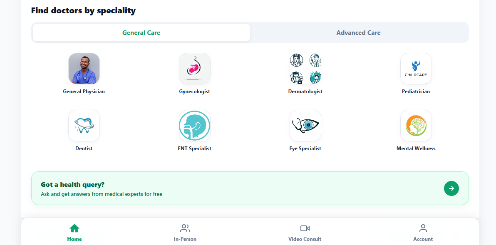
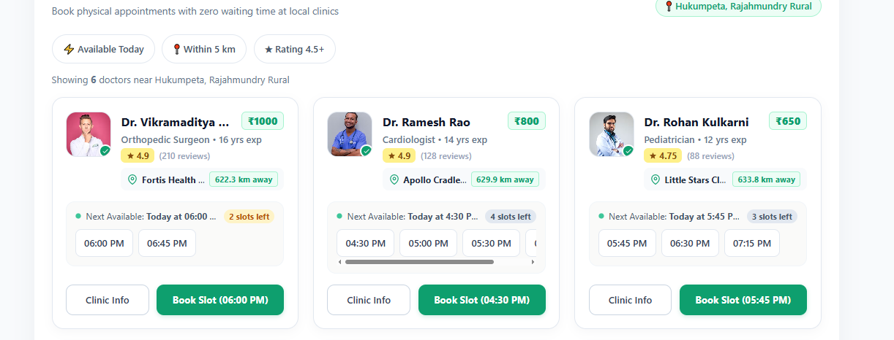

# Healio - Modern Healthcare & Teleconsultation Platform

Healio is a full-stack digital healthcare management and teleconsultation platform built to bridge the gap between patients and medical professionals[cite: 9]. It streamlines appointment scheduling, clinic visits, video consultations, and clinical workflows with real-time OTP authentication[cite: 9, 10, 12].

---

## 🌐 Live Application

- **Frontend App:** [https://healio-app-black.vercel.app](https://healio-app-black.vercel.app)
- **Backend API:** [https://healio-backend-ugg5.onrender.com](https://healio-backend-ugg5.onrender.com)

---

## 📸 Application Preview

<div align="center">
  <h3>Landing & Teleconsultation Companion</h3>
  
  <br/><br/>
  
  <h3>Patient Dashboard & Consultations</h3>
  
  <br/><br/>

  <h3>Doctor Specialities & Services</h3>
  
  <br/><br/>

  <h3>Zero Waiting-Time Clinic Bookings</h3>
  
</div>

---

## 👨‍⚕️ Default Doctor Credentials

For testing and grading the Doctor Clinical Workspace, authenticate using the pre-seeded clinical profile:

| Parameter | Value |
| :--- | :--- |
| **Doctor Name** | Dr. Ramesh Rao[cite: 10, 12] |
| **Email** | `dr.ramesh.rao@healio.health` |
| **Phone** | `+91 98450 12345` |
| **Specialization** | Cardiologist (14 yrs exp)[cite: 10, 12] |
| **Affiliation** | Apollo Cradle[cite: 12] |
| **Role** | Doctor / Workspace Admin |

> **OTP Verification:** Enter the doctor email above during login. Passkeys are routed via the transactional Resend HTTP API. During demo testing, the generated OTP is also returned safely in the response payload.

---

## ✨ Key Features

- **Passwordless OTP Authentication:** Secure 4-digit passkey login flow verified over HTTP to avoid SMTP delivery failures[cite: 7].
- **Speciality Exploration:** Filter care options by General Care (Physician, Gynecologist, Pediatrician, Dentist) or Advanced Care[cite: 11].
- **In-Person & Video Consultations:** Instant dual booking flows supporting both video calls and local physical clinic visits[cite: 9, 10].
- **Dynamic Slot Availability:** Real-time visibility into available doctor consultation slots with one-click reservation[cite: 12].
- **Location-Aware Booking:** Proximity filtering displaying nearby clinics, ratings, and doctor experience[cite: 12].

---

## 🛠️ Architecture & Tech Stack

### Frontend
- **Framework:** Angular 17+ (TypeScript)
- **Styling:** Tailwind CSS & Responsive UI Components
- **Hosting:** Vercel

### Backend
- **Framework:** Django & Django REST Framework (DRF)
- **WSGI Server:** Gunicorn
- **Database:** PostgreSQL
- **Email Infrastructure:** Resend API (HTTPS Port 443 integration)
- **Hosting:** Render Cloud Services

---

## 🚀 Local Setup Instructions

### Prerequisites
- Node.js (v18+)
- Python (v3.10+)
- Git

### 1. Repository Setup
```bash
git clone [https://github.com/your-username/Patient_Mgmt_System.git](https://github.com/your-username/Patient_Mgmt_System.git)
cd Patient_Mgmt_System

### 2. Backend Setup
```bash
cd healio-backend

# Initialize virtual environment
python -m venv venv
.\venv\Scripts\activate      # Windows
source venv/bin/activate    # macOS/Linux

# Install requirements
pip install -r requirements.txt

# Database migrations
python manage.py migrate

# Run the Django server
python manage.py runserver

### 3. Frontend Setup
```bash
# Navigate to frontend directory
cd healio-frontend

# Install dependencies
npm install

# Start local Angular development server
ng serve


## 🔐 Environment Variables

Ensure the following variables are configured across backend and frontend environments:

### Backend Variables (Render / `.env`)

| Variable | Type | Description | Example / Production Value |
| :--- | :--- | :--- | :--- |
| `SECRET_KEY` | String | Django secret key for cryptographic signing | `django-insecure-...` |
| `DEBUG` | Boolean | Enables debug mode locally; disable in production | `False` |
| `ALLOWED_HOSTS` | List / String | Allowed domain hosts serving API requests | `healio-backend-ugg5.onrender.com,localhost` |
| `CORS_ALLOWED_ORIGINS` | List / String | Allowed frontend origin domains | `https://healio-app-black.vercel.app`[cite: 1] |
| `RESEND_API_KEY` | Secret String | Resend API key for HTTP transactional OTP dispatch | `re_xxxxxxxxxxxxxxxxx` |
| `DEFAULT_FROM_EMAIL` | String | Sender address for transactional emails | `Healio <onboarding@resend.dev>` |

---

### Frontend Variables (Angular `src/environments/`)

Configure in `src/environments/environment.ts` (local) and `src/environments/environment.prod.ts` (production):

| Key | Type | Description | Production Value |
| :--- | :--- | :--- | :--- |
| `production` | Boolean | Flag enabling production optimizations | `true` |
| `apiUrl` | String | Base backend API URL | `https://healio-backend-ugg5.onrender.com` |
| `appUrl` | String | Client deployment URL | `https://healio-app-black.vercel.app`[cite: 1] |
